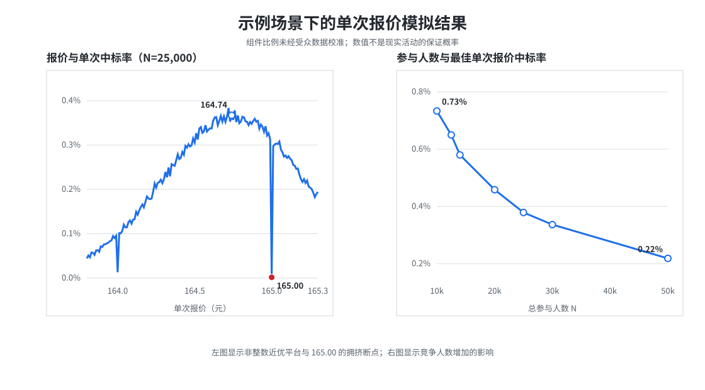

# LKs「出闲置 2026」最近均值报价：单次报价模型

> A reproducible game-theory and Monte Carlo case study of one bid in a large-population nearest-mean contest.

这个仓库研究 B 站 UP 主 LKs 举办的「出闲置 2026」活动，并以其中的 **LOT 18：HEAD Boom 网球拍＋网球**为对象，回答一个具体问题：在只能提交一次该物品报价时，怎样根据公开事实、缺失数据下的辅助先验和蒙特卡洛计算，选择一个可解释、可复现的报价？

## 结论先行

在本文明确列出的辅助先验下，最终操作报价是：

```text
164.74 元
```

这不是声称真实均值已经被精确测到分，而是一条事先定义、可由程序复核的择点规则：

1. 四个报价组件的解析加权中心为 `164.742` 元；
2. 先在 `75.13–300.13` 元做 0.25 元错相位粗搜索，效用峰定位在 `164.63`；
3. 取包含粗峰的连续 90% 粗平台 `164.38–164.88`，以中点 `164.63` 吸附到最近半元 `164.50`，再向两侧各展开 1 元，才得到 `163.50–165.50` 的逐分网格；
4. 按截止后页面显示的 `12,368` 名网球拍报价者模拟，均值为 `164.7408` 元，且细网格两端均显著劣于内部峰值；
5. `164.74` 落在平滑效用最高值的 99% 近优平台 `164.64–164.78` 内；
6. 在近优平台内选择最接近解析中心且避开整数拥挤的分币，因此得到 `164.74`。

模型没有使用可验证的 LKs 用户画像，因为没有查询到公开、可复核且披露样本方法的专属画像数据。用户给出的“网球兴趣者 35%、AI 辅助者 20%”只作为一条可替换的主观先验路线。



## 一、活动是什么

### 活动识别

|项目|公开页面信息|
|---|---|
|活动名称|**LKs 出闲置 2026**|
|活动页面|[bilibili.com/toy/lksodds/index.html](https://www.bilibili.com/toy/lksodds/index.html)|
|组织者|B 站 UP 主 LKs（页面中的活动主体）|
|藏品数量|22 件，编号 LOT 01–22|
|参与方式|每位参与者最多选择 2 件单品，分别填写“买了绝对不亏”的报价|
|中标规则|对每件物品分别计算全部报价的平均值，最接近该平均值的报价者中标|
|目标标的|LOT 18：HEAD Boom 网球拍＋网球|
|截止状态|2026-09-02 复核时倒计时为 0，活动已截止|

它不是常见的最高价拍卖，也不是“最接近商品真实价值者获胜”。对于某件物品，设共有 `N` 个报价 `b₁,…,bₙ`，结算均值为

$$
M_N=\frac{1}{N}\sum_{i=1}^{N}b_i.
$$

获胜者是使 `|bᵢ−Mₙ|` 最小的人。因此，个人需要预测的是**其他参与者会报多少**，而不只是判断球拍值多少钱。

公开页面没有说明多人同价或与均值等距时的最终裁决方式。模型暂按“并列者等概率获得物品”处理，这是一项明确的规则假设。

### 这是什么博弈

它同时具有几种结构，但每个概念都对应一个具体机制：

|理论结构|在本活动中的含义|
|---|---|
|均值猜测博弈|目标是全体报价的算术平均数，而不是商品客观价值|
|凯恩斯选美博弈|要预测别人如何估价、以及别人如何预测别人，而不只做自己的估价|
|共同锚定博弈|“历史上一折左右或更低”和约 1,500 元新品价是大家可能共同知道的锚|
|异质类型贝叶斯博弈|器材知识、保留价值、锚敏感度和信息来源不可观测，只能对其分布形成信念|
|相关信念博弈|搜索、评论区或相似 AI 回答会让许多人的误差同向，不能假设所有报价独立|
|离散动作博弈|报价精确到 0.01 元，整数与五元倍数存在同价拥挤，连续模型会漏掉这一点|
|最近均值竞赛|胜率由“离均值的距离”和“同价并列人数”共同决定，并非最接近解析期望就必然最好|

### 目标物品

活动页对 LOT 18 的描述是：

- HEAD 轻量级网球拍；
- 九五新；
- 270 克；
- 拍面 100 平方英寸；
- 页面称适合女性或新手；
- 附 3 个 Wilson 劳力士上海大师赛同款网球。

270g、100 平方英寸与公开可见的 2024 Boom MP L 规格相符，但活动页未给出 SKU 和年份，不能把具体版本当作已确认事实。

### 人数快照

|时间与信息来源|全活动提交计数|LOT 18 报价计数|在模型中的用途|
|---|---:|---:|---|
|2026-09-01 截止日当天，用户记录|194,411|12,281|当时决策可见信息|
|2026-09-02 截止后，活动页复核|195,702|12,368|主模型采用的最终页面人数 `N`|

这里必须区分全活动提交计数与单件物品报价计数。网球拍均值只由 LOT 18 的报价形成，所以主模型使用 `N=12,368`，而不是 195,702；公开页面未在这里提供可用于去重全活动计数的明细。

## 二、公开资料查到了什么

### 能直接用于分析的信息

|来源|查询结果|如何进入模型|
|---|---|---|
|[活动官方页](https://www.bilibili.com/toy/lksodds/index.html)|玩法、22 件藏品、目标物品描述、截止状态及人数|确定博弈规则、物品范围和 `N`|
|[2024 款公开促销记录](https://www.smzdm.com/p/106634903/)|相近的 270g Boom MP L 公开价格约 1,420 元|支持新品价值的大致量级|
|[近似新款公开售价](https://www.yoger.com.cn/product/515034.html)|275g 近似款页面售价 1,584 元|与上一来源共同形成约 1,500 元的参考锚|
|活动相关公开说明|此前闲置品通常为原价一折或更低|形成约 150 元的显著公共报价锚|

1,500 元只是近似新品量级，不是这把九五新旧拍的精确市场价；它在收益计算中也只是参考保留价值。模型最终预测的是人群报价均值，不是二手市场公允价值。

### 没有查到、因此不能直接估计的信息

公开查询覆盖 LKs 主页、可公开访问的第三方账号数据页、媒体资料和 B 站平台报告。没有找到同时满足“LKs 专属、公开可访问、披露样本和统计方法”的年龄、性别、地域、网球兴趣或 AI 使用比例。平台整体人口统计也不能直接外推到主动选择网球拍报价的人。

同样没有公开获得：

- LOT 18 的报价直方图、分位数或实时均值；
- 往期同类物品的逐件报价分布与最终均值；
- 并列报价的裁决细则；
- 参与者是否参考热门评论、搜索结果或相似 AI 答案。

因此，本项目没有把低相关性的泛平台画像塞进模型，而是明确转入“主观先验条件下的情景分析”。

## 三、证据、先验与模型假设

|层级|内容|地位|
|---|---|---|
|可核验事实|活动规则、物品信息、12,368 人、公开近似价格|直接约束模型|
|用户主观先验|网球兴趣者 35%、AI 辅助者 20%|辅助决策路线，可被新数据替换|
|附加模型假设|较高报价组采用共同信号的倾向为总体的 1.30 倍|用于把两个边际先验组合成联合权重|
|分布参数|四个报价中心、离散度、整数堆积、共同焦点相关性|用于生成完整报价分布，必须做敏感性分析|
|未观测真相|真实报价分布、真实人群构成、并列规则|当前结论的不确定性来源|

这一区分很重要：主观先验可以帮助作出决策，但只有在被清楚标注、能够替换和接受压力测试时才有分析价值。

## 四、从 35% 和 20% 得到四个报价组件

记：

- `F=0.35`：把“网球兴趣者 35%”映射为较高报价策略的代理比例；
- `A=0.20`：把“AI 辅助者 20%”映射为共同信号策略的代理比例；
- `r=1.30`：假设较高报价组采用共同信号的倾向是总体的 1.30 倍。

四个联合组件的权重是：

$$
\begin{aligned}
p_D &= F(Ar)=0.35\times(0.20\times1.30)=0.091,\\
p_C &= A-p_D=0.109,\\
p_B &= F-p_D=0.259,\\
p_A &= 1-p_B-p_C-p_D=0.541.
\end{aligned}
$$

代码使用中性组件名称，避免暗示它们是经过观测确认的人群身份：

|组件|权重|报价中心|标准差|报价生成机制|
|---|---:|---:|---:|---|
|A：较低中心、独立信号|54.1%|148|48|较强响应一折锚；12% 报整数、8% 报五元倍数|
|B：较高中心、独立信号|25.9%|196|58|较高价格判断；10% 报整数、10% 报五元倍数|
|C：较低中心、共同信号|10.9%|165|约 7.3|围绕 155/160/165/170/175 聚类|
|D：较高中心、共同信号|9.1%|175|约 7.3|共同焦点整体上移 10 元|

共同信号不必只来自 AI，也可能来自公开价格锚、讨论区、搜索结果或相似攻略。模型让每轮共同焦点权重满足

$$
w\sim Dirichlet(\alpha_0w_0),\qquad
w_0=(0.10,0.20,0.40,0.20,0.10),\qquad
\alpha_0=1/\rho_{shared}-1,
$$

其中默认 `ρ_shared=0.10`。35% 的共同信号报价精确落在焦点，其余加入 `σ_shared=6` 元噪声。这一设计同时描述了“大家受相似信息影响”和“整数/焦点价格容易拥挤”。

## 五、解析计算：先得到 164.742

四个组件中心的加权均值为：

$$
\begin{aligned}
E[M]
&=0.541\times148+0.259\times196\\
&\quad+0.109\times165+0.091\times175\\
&=164.742.
\end{aligned}
$$

如果其他 `N−1` 人的均值是 `M₋ᵢ`，自己的报价是 `b`，最终均值为

$$
M_N=\frac{(N-1)M_{-i}+b}{N}.
$$

在 `N=12,368` 时，个人报价对最终均值的权重只有约 `0.0081%`。因此合理策略不是操纵均值，而是预测 `M₋ᵢ` 并处理同价拥挤。

### 为什么均衡理论本身不能推出 164.74

在完全信息版本中，只要所有人的保留价值允许，任意“全体都报同一个价格 `c`”都可能是 Nash 均衡：一人偏离后，其他 `N−1` 人仍更靠近新均值，偏离者会输。于是均衡概念说明了**协调会自我维持**，却没有选择哪一个 `c`。本活动缺少真实报价分布，不能仅凭“Nash equilibrium”唯一识别价格。

在不完全信息版本中，策略写成 `b_i(t_i,s_i)`：参与者根据私人类型 `t_i` 与公共/共同信号 `s_i`，最大化对其他人报价分布的后验期望效用。大样本使个人操纵均值的空间消失，但不会消除共同信号风险。标准 `p<1` 猜均值游戏会在反复推理中向零收缩；本活动目标系数是 `1`，因此 level-k 推理围绕公共锚协调，不存在同样的零点收缩。这里的 level-0 可以是机械的一折报价，level-1 会修正器材知识与参与筛选，level-2 再预判这种修正及共同工具造成的聚类。

所以本项目不是从均衡定理“证明”164.74，而是先写出可质疑的贝叶斯先验，再计算其诱导的最优反应，并通过敏感性分析说明它在什么条件下失效。

## 六、蒙特卡洛模型如何计算胜率

对每个候选报价 `b`，模型最大化

$$
U(b)=E\left[
\Pr(\text{没有更近报价}\mid M,b)
\times\frac{(v-M)_+}{1+K_b}
\right],
$$

其中：

- `M` 是加入自己的报价后的最终均值；
- `K_b` 是与你同价且同为最近者的对手数；
- `v` 是个人最高可接受价格；
- `1/(1+K_b)` 是暂定的并列获胜份额。

每轮模拟执行以下步骤：

1. 按四个权重抽取 `N−1` 名对手所属的潜在报价组件；
2. 抽取当轮共享 Dirichlet 焦点权重，使共同信息冲击可以相关；
3. 生成条件报价总和并得到 `M₋ᵢ`；
4. 对候选分币计算所有“更接近均值”的价格区间；
5. 用离散报价 CDF 计算没有更近对手的概率；
6. 用 Poisson 近似计算同价人数及并列份额；
7. 汇总中标概率和参考效用。

主运行设置为：

- 实际页面人数 `N=12,368`；
- `75.13–300.13` 元宽域粗网格，步长 0.25 元、30,000 次模拟；
- 由粗搜索自动生成的逐分细网格，180,000 次模拟；
- 指定报价表，600,000 次模拟；
- 固定随机种子以便复现；
- 另用显式生成约一亿条对手报价的逐人模拟核对数量级。

### 为什么细网格是 163.50–165.50

`163.50–165.50` 不是模型预先认定的可行报价范围，也不是先看到 164.74 后手工画出的窗口。程序按以下顺序构造它：

|阶段|规则|默认运行结果|
|---|---|---:|
|1. 声明宽域|以 1,500 元参考价的 5%–20% 作为定位域，再整体偏移 0.13 元|75.13–300.13|
|2. 粗搜索|每 0.25 元评估一次参考效用，共 901 个候选、30,000 次情景|粗峰 164.63|
|3. 稳定粗定位|取包含最高点的连续 90% 粗平台，以平台中点吸附到最近的 0.50 元|164.38–164.88 → 164.50|
|4. 建立细窗|以标准化中心向左右各展开 1.00 元|163.50–165.50|
|5. 逐分搜索|对窗口内 201 个分币分别进行 180,000 次模拟|内部原始峰 164.71|
|6. 边界审计|两端相对效用必须都低于内部峰的 50%，否则程序每次再扩 1 元|8.9% / 40.5%，通过|

宽域的经济含义是：公开叙述把一折即约 150 元设为主要锚；5%–20% 把锚的下方和上方都留出很大余量，并覆盖模型里的 148、165、175、196 元组件中心。它只是本先验路线下的**宽域定位器**，不是对任意可能报价的数学硬约束。宽域两端的模拟效用为零或数值上接近零，峰值不在边界，因此没有迹象表明搜索区间截断了当前模型的有效峰。

粗网格从 `.13` 相位开始是有意设计：`75.13, 75.38, 75.63, 75.88, …` 不会踩到整数、半元或五元焦点。若只用整数粗搜，165.00 的同价惩罚可能使算法误以为 165 元整片区域都差；错相位粗搜只负责定位“哪一带”，最终逐分网格再完整比较整数与非整数。

程序也不让单个、仍有噪声的粗网格最高点独自决定细窗。正式运行中 164.63 为最高点，164.88 仍有 95.5% 相对效用；连续 90% 平台为 `164.38–164.88`，其中点仍为 164.63。即使 10,000 次快速模式把 164.88 暂列第一，该连续平台仍不变，因此标准化中心保持在 164.50。

选择 ±1 元还有第二层校验。默认预测均值的标准差是 `0.5706` 元，1 元约等于 `1.75σ`，这个窗口覆盖解析中心、原始 prompt 特别关注的 164.80–164.90，以及 165.00 焦点。不过，正态近似不是防止遗漏峰值的主要依据；真正的保护来自先做宽域搜索，再检查细窗边界。全域逐分扫描不仅计算成本约放大 100 倍，还会在大量候选中放大“挑到一个随机最高点”的多重比较噪声。

全部 901 个粗候选见 [`global_coarse_grid.csv`](data/results/global_coarse_grid.csv)，细网格 201 个候选见 [`illustrative_fine_grid.csv`](data/results/illustrative_fine_grid.csv)，结构化审计见 [`simulation_summary.json`](data/results/simulation_summary.json)。

### 为什么人数很大，均值仍有 0.57 元波动

独立误差会随人数按 `1/√N` 缩小，但共同信号不会。默认参数下的方差分解为：

|来源|均值方差|对应标准差|占总方差|
|---|---:|---:|---:|
|共同 Dirichlet 焦点环境|0.1200|0.3464 元|36.9%|
|条件独立的类型与个体误差|0.2056|0.4534 元|63.1%|
|合计|0.3256|0.5706 元|100%|

这解释了相关 AI/搜索信号为何是模型结构，而不只是一个“AI 用户平均报多少”的附加正态分布：即使 `N` 很大，共同权重的轮次波动也不会被大数定律完全平均掉。

## 七、结果与最终择点

### 群体均值

主模拟得到：

|指标|结果|
|---|---:|
|解析加权中心|164.7420 元|
|模拟均值|164.7408 元|
|均值标准差|0.5706 元|
|场景内 95% 区间|163.6313–165.8662 元|

该 95% 区间描述的是“假设参数全部正确时”的模拟波动，不包含先验可能错误造成的模型风险。

### 指定报价比较

以下使用 600,000 次模拟，参考效用暂取 `v=1,500` 元：

|报价|模拟中标率|参考期望效用|相对表内最高|
|---:|---:|---:|---:|
|164.50|0.5482%|7.3213|90.6%|
|164.70|0.6050%|8.0792|100.0%|
|**164.74**|**0.5966%**|**7.9663**|**98.6%**|
|164.81|0.5958%|7.9552|98.5%|
|164.83|0.5990%|7.9975|99.0%|
|164.84|0.6039%|8.0632|99.8%|
|164.85|0.5958%|7.9546|98.5%|
|165.00|0.0038%|0.0506|0.6%|

生成的 CSV 同时给出蒙特卡洛标准误。上述非整数候选的单点效用标准误约为 `0.089`；由于所有候选复用同一批随机情景，候选之间高度相关，不能把两个边际标准误直接相加作显著性检验。它至少表明：把百分之零点几的原始效用差异解释成稳定排序并不可靠。

单个分币的原始最大值会随随机种子和重复次数在近邻之间跳动。为避免追逐蒙特卡洛噪声，程序对逐分效用使用 15 点居中平均：

$$
\bar U_{15}(b_j)=\frac{1}{15}\sum_{k=-7}^{7}\widehat U(b_{j+k}).
$$

在 `N=12,368` 的完整细网格中：

- 原始网格最高点：`164.71`；
- 平滑最高点：`164.67`；
- 平滑效用达到最高值 99% 的区间：`164.64–164.78`；
- 达到最高值 97.5% 的区间：`164.61–164.89`。

最终选择 `164.74` 的规则是：**先确定统计上的近优平台，再在平台内选择最接近解析中心 `164.742` 的非整数分币。** 这比把一次模拟中偶然最高的 164.70、164.71 或 164.84 当作真值更稳定。

### 为什么不选择 165.00

165 元同时是整数和共同信号焦点。默认场景中，165.00 的中标率约为 `0.0038%`，附近非整数报价约为 `0.60%`，相差约 150 倍。原因不是 165 离预测均值太远，而是模型中的大量同价者显著稀释并列份额。

这个倍率依赖整数堆积假设，但“在均值附近避开最显眼的整数焦点”是比迷信某个随机最高分币更稳健的局部原则。

## 八、敏感性分析

以下单因素压力测试统一在 `N=25,000` 下进行，作用是测量参数方向，而不是替代主模型的 `N=12,368`：

|改变的参数|低端结果|默认结果|高端结果|
|---|---:|---:|---:|
|较高报价组件占比|25% → 161.03|35% → 164.83|45% → 168.48|
|较低独立组件中心|136 → 158.29|148 → 164.78|160 → 171.18|
|较高独立组件中心|180 → 160.58|196 → 164.75|212 → 168.82|
|相对一折锚的偏离尺度|1.30 → 169.30|1.00 → 164.65|0.65 → 159.54|
|共同信号占比|10% → 164.74|20% → 164.81|30% → 164.86|
|共同信号相关性|低 → 164.74|中 → 164.69|高 → 164.74|

核心判断是：较高报价组件比例、两个独立报价中心和价格锚响应决定均值的位置；共同信号比例与相关性更多影响均值波动和同价拥挤。广泛改变行为参数时，最优点可跨越约 `158.29–171.18` 元，远大于相邻几分钱的差异。

## 九、局限性

1. **没有真实报价分布。** 模型是先验预测，不是从 LOT 18 报价拟合出的后验模型。
2. **用户画像不可识别。** 35% 和 20% 是主观输入，不能解释成调查结果。
3. **自我选择未被观测。** 主动选择网球拍的人可能与 LKs 全体观众明显不同。
4. **报价中心是约化参数。** 148、196、165、175 元概括行为机制，没有逐项微观数据直接识别它们。
5. **并列规则未知。** 等概率分配只是工作假设；官方若采用最早提交、抽签或其他规则，效用需要重算。
6. **共同信号结构简化。** Dirichlet 焦点簇只能近似讨论区、搜索和 AI 输出之间的相关性。
7. **模拟存在数值误差。** 单分币差异很小，原始极大值会随随机种子变化。
8. **商品价值与战略报价不同。** 即使市场估值准确，也不能直接得到参与者平均报价。
9. **模型是静态的。** 没有观察截止前参与人数变化、信息传播与参与者临时修改判断的过程。

因此，`164.74` 应读作“这组先验下的透明操作选择”，不能写成“现实中的唯一最优报价”。

## 十、后续改进方向

按信息价值排序，最值得补充的是：

1. **匿名报价直方图。** 即使只提供 1 元或 5 元分箱，也能直接估计均值、离散度和整数堆积。
2. **官方最终结果。** 记录 LOT 18 的最终均值、中标价、并列人数和裁决方式，用于事后校准。
3. **往期同类物品数据。** 用层级贝叶斯模型联合估计“原价锚、品类熟悉度、成色和人群选择”对报价的影响。
4. **参与者匿名问卷。** 只收集器材熟悉度、估价区间和信息来源，不需要个人身份信息。
5. **从点先验改为先验分布。** 例如让 35%、20% 和四个中心本身服从分布，报告后验报价区间而不是单一路线。
6. **稳健决策。** 在多组可接受参数上最大化最坏情形效用，或最小化后悔值，检验 164.74 是否仍是跨场景折中点。
7. **更精确的并列模型。** 获得官方规则后，替换当前 Poisson 并列近似并重新计算。
8. **校准与评分。** 事后用真实均值检验预测误差，并公开 Brier score、覆盖率或后悔值，避免只展示命中的案例。

其中前两项的价值最高：少量真实报价数据通常比继续扩展用户画像更能改善模型。

## 十一、如何复现

需要 Python 3.10 或更高版本：

```bash
python -m venv .venv
# Windows PowerShell
.venv\Scripts\Activate.ps1
python -m pip install -r requirements.txt

# 快速检查，写入临时目录
python src/lks_tennis_mc.py --quick --section main --output-dir work/quick-check

# 完整主模型与敏感性分析
python src/lks_tennis_mc.py --section all --output-dir data/reproduced-main

# 计算量较大的逐人校验
python src/lks_tennis_mc.py --section direct --output-dir data/reproduced-direct
```

程序会输出解析均值、原始网格最高点、15 分平滑区间和最终操作报价。可以使用 `--participants` 更新目标物品人数，并用以下参数替换主观先验：

```bash
python src/lks_tennis_mc.py --quick --section main \
  --participants 12368 \
  --upper-strategy-share 0.30 \
  --shared-signal-share 0.10 \
  --anchor-scale 0.80 \
  --output-dir work/alternative-scenario
```

更详细的环境与文件说明见 [复现说明](docs/reproducibility.md)，完整数学讨论见 [分析报告](reports/full-analysis.md)。

## 十二、仓库结构

```text
.
├── README.md
├── requirements.txt
├── src/
│   └── lks_tennis_mc.py
├── reports/
│   └── full-analysis.md
├── data/results/
│   ├── illustrative_fine_grid.csv
│   ├── global_coarse_grid.csv
│   ├── illustrative_requested_quotes.csv
│   ├── one_way_sensitivity.csv
│   ├── participants_sensitivity.csv
│   ├── replication_convergence.csv
│   ├── direct_person_level_validation.csv
│   └── simulation_summary.json
├── docs/
│   ├── key-results.svg
│   └── reproducibility.md
└── scripts/
    └── create_figure.py
```

本项目用于博弈论、行为建模和蒙特卡洛方法的教育与复核，不保证活动结果。参与者还应根据自己的最高可接受价格决定是否报价。
